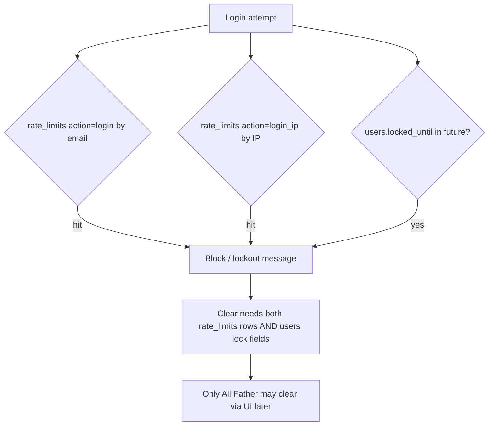
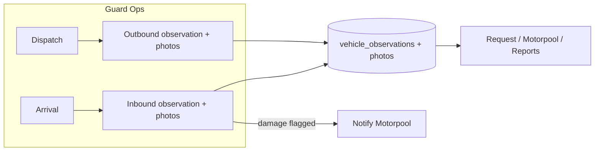
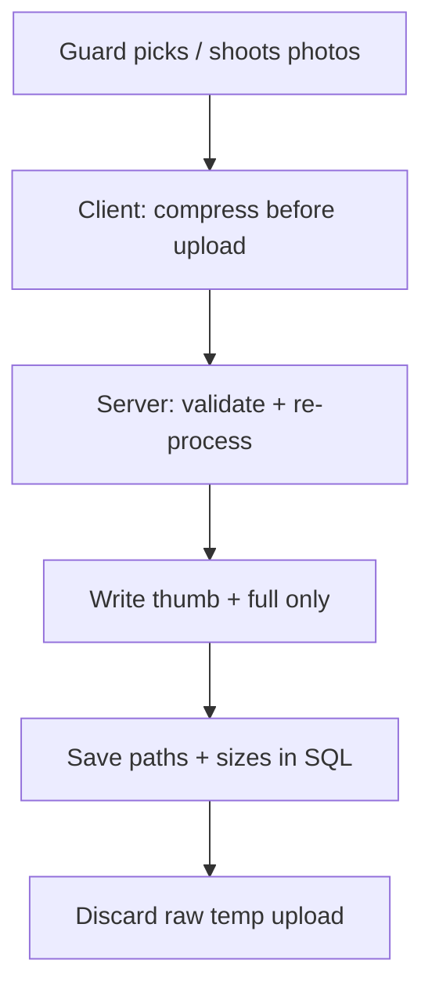

# All Father, Rate-Limit Clear & Guard Vehicle Observations Plan

## Overview

Two tracks in one plan:

1. **All Father** — god / super-super-admin role; exclusive **clear rate limits / unlock accounts** (manual SQL now; UI later).
2. **Guard vehicle observations** — guards document vehicle **condition before dispatch and upon arrival** with notes + photos, so management has a proper paper trail of what was seen at the gate.

Related code today:

| Piece | Location |
|-------|----------|
| Login rate limit (email + IP) | [`classes/Auth.php`](../public_html/classes/Auth.php) |
| `rate_limits` CRUD helpers | [`classes/Security.php`](../public_html/classes/Security.php) |
| Thresholds | [`config/security.php`](../public_html/config/security.php) — 5 attempts / 15 min window; account lock 30 min |
| Roles | [`config/constants.php`](../public_html/config/constants.php) — highest today is `admin` (level 5) |
| Global IP throttle (prod only) | [`index.php`](../public_html/index.php) + `Security::checkGlobalRateLimit` / `isIpBanned` |
| Guard dispatch / arrival | [`pages/guard/index.php`](../public_html/pages/guard/index.php), [`pages/guard/actions.php`](../public_html/pages/guard/actions.php) |
| Guard notes today | Free-text `requests.guard_notes` only — **no structured condition, no photos** |
| Uploads | [`classes/FileUpload.php`](../public_html/classes/FileUpload.php) — already has `createImageHandler()` |



---

## Part A — Manual clear now (database)

Use database **`fleetdb`** (or your current env DB). Run in phpMyAdmin → SQL, or MySQL CLI.

### A1. Inspect what is locked / rate-limited

```sql
-- Account lockouts on users
SELECT id, email, name, role, status,
       failed_login_attempts, locked_until, last_failed_login
FROM users
WHERE deleted_at IS NULL
  AND (
    locked_until IS NOT NULL AND locked_until > NOW()
    OR failed_login_attempts >= 5
  )
ORDER BY locked_until DESC;

-- Recent rate-limit hits (login / IP / password)
SELECT id, action, identifier, ip_address, created_at
FROM rate_limits
WHERE created_at > DATE_SUB(NOW(), INTERVAL 24 HOUR)
ORDER BY created_at DESC
LIMIT 200;

-- Distinct identifiers currently in the login window (~15 min)
SELECT action, identifier, COUNT(*) AS attempts, MAX(created_at) AS last_hit
FROM rate_limits
WHERE action IN ('login', 'login_ip', 'password_reset', 'password_change')
  AND created_at > DATE_SUB(NOW(), INTERVAL 15 MINUTE)
GROUP BY action, identifier
ORDER BY attempts DESC;
```

### A2. Clear **one user** by email (recommended)

Replace `user@example.com` with the locked account email.

```sql
-- 1) Clear login attempt rows for that email
DELETE FROM rate_limits
WHERE action = 'login'
  AND identifier = 'user@example.com';

-- 2) Unlock the user row
UPDATE users
SET failed_login_attempts = 0,
    locked_until = NULL,
    last_failed_login = NULL
WHERE email = 'user@example.com'
  AND deleted_at IS NULL;
```

If login is still blocked, the **IP** may still be limited (`login_ip`). Find their IP from recent rows, then clear it:

```sql
-- See IPs tied to that email's recent attempts
SELECT DISTINCT ip_address
FROM rate_limits
WHERE identifier = 'user@example.com'
   OR (action = 'login_ip' AND created_at > DATE_SUB(NOW(), INTERVAL 1 HOUR));

-- Clear a specific IP (replace 192.168.x.x)
DELETE FROM rate_limits
WHERE action = 'login_ip'
  AND identifier = '192.168.x.x';
```

### A3. Clear **yourself** (dev / local testing)

Same as A2 with your email. Optionally nuke all login-related limits (dev only — **do not run on production casually**):

```sql
-- DEV / emergency only
DELETE FROM rate_limits
WHERE action IN ('login', 'login_ip', 'password_reset', 'password_change');

UPDATE users
SET failed_login_attempts = 0,
    locked_until = NULL,
    last_failed_login = NULL
WHERE deleted_at IS NULL
  AND (locked_until IS NOT NULL OR failed_login_attempts > 0);
```

### A4. Password-reset / password-change throttles

```sql
DELETE FROM rate_limits
WHERE action = 'password_reset'
  AND identifier = 'user@example.com';

DELETE FROM rate_limits
WHERE action = 'password_change'
  AND identifier = '123';   -- user id as string
```

### A5. Global IP ban / DDoS tables (if still blocked after A2–A3)

If production returns “Too many requests” before login UI loads, also check whatever table/method `Security::isIpBanned()` uses (confirm in [`classes/Security.php`](../public_html/classes/Security.php) before deleting). Clear that IP’s ban row the same way after identifying it.

### A6. Verify unlock

```sql
SELECT email, failed_login_attempts, locked_until
FROM users
WHERE email = 'user@example.com';

SELECT COUNT(*) AS remaining_login_hits
FROM rate_limits
WHERE action = 'login' AND identifier = 'user@example.com'
  AND created_at > DATE_SUB(NOW(), INTERVAL 15 MINUTE);
```

Then try logging in again.

---

## Part B — New role: **All Father**

### Intent

| Role | Level (proposed) | Purpose |
|------|------------------|---------|
| … existing roles … | 1–5 | Day-to-day ops |
| `admin` | 5 | Normal system administrator |
| **`all_father`** | **99** | God mode — rare, usually **one** human account |

Display label: **All Father**  
Constant: `ROLE_ALL_FATHER = 'all_father'`  
Above every `hasRole()` check that uses `ROLE_LEVELS`.

### Rules

1. **Only All Father** can clear rate limits / unlock accounts via the app UI.
2. Regular `admin` keeps user CRUD but **cannot** unlock / clear rate limits (must escalate or use DB until UI ships — or temporarily allow admin only in `APP_ENV=development` if you want a soft escape hatch; recommend **no** escape hatch in production).
3. All Father inherits everything admin can do (treat as `hasRole(ROLE_ADMIN)` true when role is All Father, **or** set level 99 so all `hasRole(minRole)` checks pass).
4. Creating / assigning the All Father role should be **hard-gated**:
   - Prefer: only an existing All Father can assign the role; bootstrap first account via one-time SQL/migration.
   - Never show “All Father” in the normal role dropdown for admins.
5. Audit every clear action into `security_logs` (who cleared whom/what, IP, timestamp).

### Schema / code touchpoints (implementation later)

- `config/constants.php` — `ROLE_ALL_FATHER`, `ROLE_LEVELS`, `ROLE_LABELS`
- `pages/users/create.php` / `edit.php` — valid roles whitelist; hide All Father from normal admins
- `includes/functions.php` — helpers: `isAllFather()`, `canClearRateLimits()`
- Users table `role` column: if ENUM, `ALTER TABLE` to add `'all_father'`; if VARCHAR, just insert the value
- Bootstrap SQL (one-time):

```sql
-- After role is allowed on users.role:
UPDATE users
SET role = 'all_father'
WHERE email = 'YOUR_EMAIL_HERE'
  AND deleted_at IS NULL
LIMIT 1;
```

---

## Part C — App feature: Clear rate limits (All Father only)

### UI (recommended)

New page (sidebar under Admin / Security, All Father only):

**Security → Rate limits & lockouts**  
`/?page=security&action=rate-limits` (name flexible)

| Panel | Content |
|-------|---------|
| Locked accounts | Table from `users` where `locked_until > NOW()` or high `failed_login_attempts` — button **Unlock** |
| Active rate limits | Aggregated `rate_limits` by `action` + `identifier` in window — button **Clear** |
| Clear by email / IP | Simple form: email and/or IP → clears matching rows + unlocks user |
| Audit | Last N `security_logs` events: `rate_limit_cleared`, `account_unlocked` |

### Backend

- Reuse `Security::clearRateLimits($action, $identifier)`
- Add `Auth::unlockAccount($userId)` (public wrapper around today’s private `clearFailedAttempts`)
- Endpoint/action guarded: `requireAllFather()` (403 otherwise)
- CSRF + POST only; no GET unlock links
- Log: `security_logs.event = 'rate_limit_cleared'` with details JSON (target email/IP/user id)

### Success criteria

- Locked user can log in immediately after All Father clears
- Admin account cannot reach the page or call the action
- Every clear leaves an audit row

---

## Part D — Recommended exclusive features for All Father

These are **god-tier** capabilities that should stay off normal admin screens. Prioritize later by need; none of these are required for the rate-limit clear MVP.

### Tier 1 — Security & break-glass (high value)

| Feature | Why exclusive |
|---------|----------------|
| **Clear rate limits / unlock accounts** | Core request; abuse would enable brute force |
| **View / export security_logs** (full) | Sensitive attack intel |
| **Force-logout all sessions** for a user (or everyone) | Incident response |
| **IP ban / unban** management | DDoS / abuse controls |
| **Emergency maintenance mode** toggle | Site-wide banner / read-only |

### Tier 2 — Data integrity & recovery

| Feature | Why exclusive |
|---------|----------------|
| **Soft-delete restore** (users, vehicles, requests) | Undelete is dangerous in wrong hands |
| **Hard-delete / purge** with typed confirmation | Irreversible |
| **Impersonate user** (“View as”) with audit + banner | Support debugging; never for normal admin |
| **Reassign request ownership / bypass workflow** | Breaks approval integrity if misused |
| **Raw system settings** (security thresholds, session timeouts) | Misconfig locks everyone out |

### Tier 3 — Observability & ops

| Feature | Why exclusive |
|---------|----------------|
| **Email queue god view** — flush, retry, purge all | Can spam or wipe notifications |
| **Cron / job health** + manual trigger | Ops only |
| **DB health / migration status** read-only panel | Avoid exposing to every admin |
| **Feature flags** (kill switches per module) | Strategic control |

### Tier 4 — Identity of the role itself

| Feature | Why exclusive |
|---------|----------------|
| **Promote / demote All Father** (max 1–2 accounts) | Prevent privilege sprawl |
| **All Father activity feed** | Who used god powers |
| **Require re-auth / step-up password** before god actions | Extra friction on destructive ops |

### Explicitly keep for normal `admin` (not All Father-only)

- User / department / vehicle / driver CRUD  
- Approvals, reports, gas vouchers, maintenance  
- Day-to-day settings that aren’t security break-glass  

All Father should **not** replace admin for routine work — it should appear rarely, for emergencies and platform control.

---

## Phased rollout

### P0 — Manual (now)

1. Run **Part A** SQL to unlock yourself / affected accounts.
2. Optionally set your user `role` only after Part B constants exist (or leave as `admin` until code ships).

### P1 — Role + clear UI

1. Migration: allow `all_father` on `users.role`.
2. Constants + `isAllFather()` / `canClearRateLimits()`.
3. Bootstrap one All Father account via SQL.
4. Security page: list locks + clear/unlock (All Father only) + audit log.
5. Hide role from admin user forms; only All Father can assign it.

### P2 — God toolkit

1. Impersonation (optional, audited).
2. Soft-delete restore.
3. Force logout / IP ban UI.
4. Step-up confirmation on destructive actions.

### P3 — Guard vehicle observations (see Part E)

1. Migration for observation + photo tables (include thumb/full paths + sizes).
2. Shared `optimizeObservationImage()` helper (GD/Imagick) + client-side compress before upload.
3. Extend Guard Ops dispatch/arrival forms with condition checklist + multi-photo upload.
4. Show gallery (thumbs) on request / trip views; lightbox loads full.
5. Optional: block arrival without photos when policy requires them; damage → notify motorpool.
6. Orphan file cleanup + storage usage note for All Father/admin.

---

## Part E — Guard vehicle condition observations (dispatch + arrival)

### Problem / management ask

Guards already record **when** a vehicle leaves and returns ([`pages/guard/actions.php`](../public_html/pages/guard/actions.php)), plus optional text in `guard_notes`. Management wants them to **report what they see** about vehicle condition:

- **Before dispatch** (outbound inspection)
- **Upon arrival** (return inspection)
- With **details + pictures** so damage / missing items / dirty state is documented and attributable

Today there is **no photo capture** and no structured condition fields on the guard flow.



### Recommended product design

**Primary UX:** Fold observations into the existing Guard Ops modals / forms (same place guards already press Dispatch / Arrival). Do **not** invent a separate “camera app” — keep one gate workflow.

| Moment | When | Required? (recommended default) |
|--------|------|-----------------------------------|
| **Outbound** | On `record_dispatch` | Condition rating + notes required; **at least 1 photo** (configurable) |
| **Inbound** | On `record_arrival` | Condition rating + notes required; **at least 1 photo**; optional damage checklist |

**Condition fields (keep short — guards are at the gate):**

- Overall condition: `good` / `fair` / `poor` / `damaged` (radio or select)
- Checklist (booleans or multi-select): exterior damage, interior damage, flat/low tire, lights issue, fuel low, unclean, missing accessories/tools, other
- Free-text notes (500–1000 chars)
- Optional odometer reading photo (separate from mileage number already captured on arrival)
- Photos: 1–6 images per observation — **always processed to lightweight JPEG/WebP** (see **E0 — Image compression & size management**). Do not store raw phone dumps (often 4–12MB each).

**Compare outbound vs inbound (management value):** On request view, show a side-by-side “Left looking like X / Returned looking like Y” with thumbnails. If inbound = `damaged` or any damage checkbox differs from outbound, auto-notify motorpool (+ optional CAF).

### Data model (recommended)

Do **not** overload `requests.guard_notes` with JSON. Use dedicated tables (SQL storage, env-specific DBs as usual):

```sql
-- One observation per phase per request (guard can amend only before phase is "locked")
CREATE TABLE vehicle_observations (
  id INT UNSIGNED AUTO_INCREMENT PRIMARY KEY,
  request_id INT UNSIGNED NOT NULL,
  vehicle_id INT UNSIGNED NULL,
  phase ENUM('dispatch','arrival') NOT NULL,
  guard_id INT UNSIGNED NOT NULL,
  overall_condition ENUM('good','fair','poor','damaged') NOT NULL,
  flags_json JSON NULL,              -- checklist: {"exterior_damage":true,...}
  notes VARCHAR(1000) NULL,
  mileage_reading INT UNSIGNED NULL, -- optional snapshot at gate
  observed_at DATETIME NOT NULL,
  created_at DATETIME NOT NULL,
  updated_at DATETIME NULL,
  UNIQUE KEY uq_request_phase (request_id, phase),
  KEY idx_vehicle (vehicle_id),
  KEY idx_guard (guard_id)
);

CREATE TABLE vehicle_observation_photos (
  id INT UNSIGNED AUTO_INCREMENT PRIMARY KEY,
  observation_id INT UNSIGNED NOT NULL,
  file_path VARCHAR(500) NOT NULL,  -- relative under uploads/
  file_name VARCHAR(255) NOT NULL,
  mime_type VARCHAR(100) NOT NULL,
  file_size INT UNSIGNED NOT NULL,
  caption VARCHAR(200) NULL,        -- e.g. "front", "left side", "scratch near door"
  sort_order TINYINT UNSIGNED NOT NULL DEFAULT 0,
  created_at DATETIME NOT NULL,
  KEY idx_observation (observation_id)
);
```

**Storage path:** `uploads/vehicle_observations/{request_id}/{phase}/`  
Serve via existing secure file viewer pattern in [`index.php`](../public_html/index.php) (same approach as trip-ticket docs — **not** publicly listable directories).

Store **two derivatives per shot** (recommended):

| Variant | Purpose | Target |
|---------|---------|--------|
| `thumb_*.jpg` | Gallery / list strip | max edge **480px**, quality ~72, typically **30–80 KB** |
| `full_*.jpg` (or `.webp`) | Lightbox / evidence | max edge **1600px**, quality ~82, typically **150–400 KB** |

Never keep the original phone file on disk after successful processing (unless All Father “retain original” debug flag is on — default **off**).

Add columns on `vehicle_observation_photos` (or derive paths by convention):

- `thumb_path`, `full_path`
- `width`, `height` (of full variant)
- `file_size` (full variant bytes)
- optional `bytes_original` (for audit only, not stored file)

### E0 — Image compression & size management (required)

Goal: **lightweight storage without looking bad** on phone/desktop. Prefer smart resize + high-quality JPEG/WebP over aggressive low-quality crush.

#### Targets (defaults — tunable in settings)

| Rule | Value | Why |
|------|-------|-----|
| Max upload (raw, before process) | **8 MB** | Reject absurd dumps early |
| Max edge (full) | **1600 px** | Enough for scratch/dent detail; cuts 12MP → ~2MP |
| Max edge (thumb) | **480 px** | Fast galleries |
| Encode | **JPEG q≈80–85** or **WebP q≈80** | Visually near-original for gate photos; much smaller than PNG |
| Strip EXIF / GPS | **Yes** (keep orientation via autorotate first) | Privacy + smaller files |
| Max photos / phase | **6** | Hard cap clutter |
| Max storage / observation | ~**2.5 MB** combined fulls | Soft budget after compression |
| Reject after compress if full still **> 700 KB** | Re-encode at q-=5 or shrink to 1280px | Safety net |

Rough expectation: 4 photos × ~250 KB ≈ **1 MB per phase** instead of 4 × 5 MB = 20 MB.

#### Pipeline (implement in this order)



1. **Client-side (browser) — first line of defense**  
   - Use canvas / `createImageBitmap` (or a small lib like **browser-image-compression**) before `FormData` submit.  
   - Resize longest edge to ≤1600px, output JPEG ~0.8 quality.  
   - Show size preview (“4 photos ≈ 900 KB”) so guards know it worked.  
   - Still allow submit if client compress fails — **server must not trust the client**.

2. **Server-side (authoritative) — PHP GD or Imagick**  
   - After `FileUpload` accepts temp file: autorotate from EXIF, strip metadata, resize, encode JPEG/WebP.  
   - Prefer **Imagick** if available on XAMPP/prod; else **GD** (`imagecreatefromjpeg` / `imagewebp`).  
   - Central helper e.g. `includes/image_optimize.php` → `optimizeObservationImage($tmpPath): array{thumb, full, meta}` reused everywhere.  
   - Validate MIME with `finfo`, not extension alone; re-encode always (defeats polyglot uploads).

3. **Quality-preserving tactics (do these)**  
   - Downscale resolution **before** lowering quality (biggest win).  
   - Use progressive JPEG or WebP.  
   - Sharpen lightly after downscale (optional 0.5 unsharp) so 1600px still looks crisp.  
   - Keep damage close-ups usable: if user captions “damage”, allow full max edge **1920px** for that file only (still compress).

4. **What not to do**  
   - Do not store PNG from phone cameras (huge). Convert to JPEG/WebP.  
   - Do not keep both original + compressed “just in case” in prod.  
   - Do not use tiny 640px full images — that *does* sacrifice evidence quality.  
   - Do not rely only on `MAX_FILE_SIZE` without resize — 5MB limits still clutter disk.

5. **Lifecycle / clutter control**  
   - Orphan cleanup cron: delete files with no DB row (daily).  
   - Optional retention: after N months, keep thumbs + one full, or archive to cold storage (P4).  
   - Admin/All Father storage report: total MB under `uploads/vehicle_observations/`.

6. **Acceptance checks (when implementing)**  
   - iPhone/Android sample: raw ~6MB → full ≤400KB, thumb ≤80KB, scratch still readable at 100% zoom on full.  
   - 6 photos dispatch + 6 arrival ≈ **≤ 5 MB** disk for the whole trip.  
   - Gallery loads thumbs only; full fetched on lightbox click.

### Implementation approach (how to build it)

#### E1. Extend Guard Ops forms (P3)

In [`pages/guard/index.php`](../public_html/pages/guard/index.php) dispatch + arrival modals, add:

1. Overall condition select  
2. Compact checklist (DaisyUI checkboxes)  
3. Notes textarea (keep / replace ambiguous “guard notes” for condition; keep travel-doc notes separate)  
4. Multi-file input `accept="image/*" capture="environment"` so phones open the rear camera when possible  
5. Client-side preview thumbnails + **client compress** before submit (see E0)  
6. Live “estimated upload size” label  

Form must use `enctype="multipart/form-data"`.

#### E2. Persist in `record_dispatch` / `record_arrival`

In [`pages/guard/actions.php`](../public_html/pages/guard/actions.php):

1. Validate condition + photo count (respect settings).  
2. Insert `vehicle_observations` row for phase.  
3. For each image: temp upload → **`optimizeObservationImage()`** → write thumb + full → insert `vehicle_observation_photos` (sizes of full variant).  
4. Delete temp/raw file.  
5. Keep existing dispatch/arrival time + mileage behavior.  
6. `auditLog('vehicle_observation_recorded', ...)`.  
7. If arrival marks damage → `notify()` motorpool head(s).

**Transaction:** wrap DB writes; if upload/optimize fails mid-way, roll back observation and delete any written variants.

#### E3. Who can see what

| Role | Access |
|------|--------|
| Guard | Create/edit observation for trips they are processing; view own + today’s trips |
| Motorpool / Admin / CAF | View all photos + condition on request/trip detail; filter “damaged returns” |
| Requester / Driver | Optional: view photos of **their** trip only (management decision — recommend **yes** for transparency) |
| All Father | Full access + hard-delete photo / observation (break-glass; audited) |

#### E4. Request / completed-trip UI

On request view + guard completed list:

- Section **Vehicle condition**
  - Outbound: badge + notes + thumbnail strip  
  - Inbound: badge + notes + thumbnail strip  
  - Lightbox / modal for full-size images  
- Print/PDF trip summary: include condition labels + optional small image grid (or “N photos on file” if PDF size is a concern)

#### E5. Settings (admin / All Father)

| Setting | Default |
|---------|---------|
| Require photo on dispatch | On |
| Require photo on arrival | On |
| Min photos / max photos | 1 / 6 |
| Full max edge (px) | 1600 (1920 for damage caption) |
| Thumb max edge (px) | 480 |
| JPEG / WebP quality | 82 |
| Max raw upload | 8 MB |
| Max full file after compress | 700 KB (re-encode if over) |
| Require damage note when condition = damaged | On |
| Block arrival submit without observation | On |
| Notify motorpool on damaged arrival | On |
| Retain original files | Off |

Store in existing settings pattern if one exists; otherwise `system_settings` key/value.

#### E6. Optional later enhancements

- Photo **angle presets** (Front / Rear / Left / Right / Interior / Damage close-up) as caption dropdown — improves consistency  
- Side-by-side “before vs after” slider for the same angle  
- Link damaged arrival → create **maintenance request** draft for that vehicle  
- Report: “Vehicles returned damaged this month” for CAF / motorpool  
- Offline-friendly: queue uploads if signal drops (P4; not needed for XAMPP MVP)

### Why this shape (vs alternatives)

| Approach | Verdict |
|----------|---------|
| Only longer `guard_notes` | Reject — no photos, not searchable by condition |
| Photos only on trip tickets | Reject — tickets are often after-the-fact; gate moment is dispatch/arrival |
| Separate observation page | Secondary — OK as “edit photos later”, but **primary** path must stay on Guard Ops submit |
| Store images in DB BLOB | Reject — use filesystem + SQL paths (matches trip tickets) |

### Success criteria

- Guard cannot complete dispatch/arrival (when settings require) without condition + photo(s)  
- Motorpool can open a completed trip and see outbound vs inbound photos  
- Damaged arrival notifies motorpool and is filterable  
- Uploads are size/type validated; paths not world-browsable  
- Audit trail: which guard, when, which phase  
- Photos are **compressed** (client + server): typical full ≤400KB, thumb ≤80KB; damage detail still readable  
- No raw multi‑MB originals left on disk after success  
- Galleries load thumbs first; full only on demand  

### All Father touchpoint (optional exclusive)

- Permanently delete a mistaken / sensitive photo set (audited)  
- Override “photos required” for a single trip (emergency gate failure)  
- View global observation compliance stats (how often guards skip when optional)

---

## Open decisions

1. **Role slug:** `all_father` (recommended) vs `allfather` vs `god`.
2. **How many All Father accounts:** recommend **1** (you); hard-cap at 2.
3. **Does All Father appear in Approvals as an approver?** Recommend **no** — keep god account out of business workflows; use a separate requester/admin identity for daily trips if needed.
4. **Dev escape hatch:** allow `admin` to clear rate limits only when `APP_ENV !== 'production'`? Useful for XAMPP; keep production All-Father-only.
5. **Guard photos required or optional at launch?** Recommend **required** (min 1) for both phases once live; soft-launch optional for 1 week if training is needed.
6. **Can requesters see gate photos?** Recommend **yes** (own trips only).
7. **Caption presets vs free caption only?** Recommend presets + optional free text.

---

## Recommendation summary

| Need | Plan |
|------|------|
| Unlock accounts **today** | Part A SQL: delete `rate_limits` + reset `users` lock fields (email **and** IP if needed) |
| Who may clear in-app later | New role **All Father** (`all_father`, level 99) — exclusive |
| First exclusive feature | Rate-limit / lockout clear UI with audit |
| Other exclusive ideas | Break-glass security, restore/purge, impersonate, force logout, IP ban, maintenance mode, feature flags |
| Guard condition reports | Part E: observations + photos on dispatch **and** arrival inside Guard Ops; SQL tables; reuse `FileUpload`; motorpool notified on damage |
| Lightweight photos | Part **E0**: client + server resize/compress; thumb 480px + full 1600px; discard originals; ~1MB/phase typical |
| Management documentation | Side-by-side outbound/inbound on request view; filter damaged returns; optional maintenance draft |

**Do not implement application code until this plan is committed and you ask to build it.** Part A SQL remains available for manual unlocks anytime. Guard observations are **P3** after All Father clear UI unless you prioritize the gate photos first.
