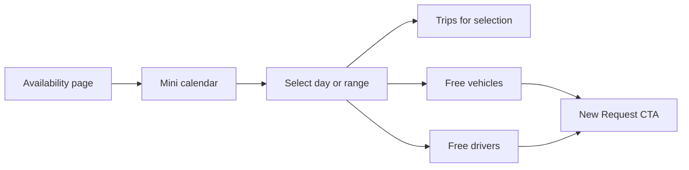

# Availability Revamp Plan

## Overview

Redesign **Availability** (`/?page=schedule&action=calendar`) into a clear **trip-planning guide** for requesters (and ops): fix weak cell borders, add a usable mini calendar with day/range selection, and show **which vehicles and drivers are free**—not only a vague “X/Y free” badge.

## Current state (baseline)

Main page: [`public_html/pages/schedule/calendar.php`](../public_html/pages/schedule/calendar.php)  
Sidebar: **Availability** → all logged-in users ([`includes/sidebar.php`](../public_html/includes/sidebar.php))

What exists today:

- Custom **month grid** (not FullCalendar) with prev/next month
- Day cells show up to 3 trip pills + inert “+N more”
- Badge `N/M free` = fleet size minus distinct assigned vehicles that day
- Table of scheduled trips for the month below
- Trips: `approved` + `pending_motorpool` only

Gaps (matches your observations):

| Issue | Today |
|-------|--------|
| Borders hard to see | Double/competing borders + low-contrast theme tokens; styles are page-inline only |
| Day click | Days are not clickable; no day detail panel |
| Date range | Month-only; no custom from–to |
| Available vehicles/drivers | No list—only aggregate free count; **drivers ignored entirely** |
| Fleet definition | Uses `status != 'retired'` (may not match real statuses: available / in_use / maintenance / out_of_service) |

Conflict helpers already exist but are **not used** by Availability:

- `checkVehicleConflict()` / `checkDriverConflict()` in [`includes/functions.php`](../public_html/includes/functions.php)
- AJAX: `/?page=api&action=check_conflict` ([`pages/api/check_conflict.php`](../public_html/pages/api/check_conflict.php))
- Used today on request create + approvals assignment



## Recommended product direction (better than calendar-only)

**Primary job:** Help a requester answer: *“When can I go, and what’s free?”*

Recommended layout (desktop):

1. **Left (~320px): Mini calendar** — month navigator, clear cell borders, occupancy tint, click day (shift/click or dual pickers for range)
2. **Right: Detail panel** for the selected day or range
   - **Trips** scheduled (time, destination, plate, status)
   - **Available vehicles** (plate, type, status)
   - **Available drivers** (name, status)
   - CTA: **New Request** (optionally prefill `start_date` / `end_date` query params)
3. **Optional bottom:** compact month trip table (keep for print/scan) or collapse behind “Show all month trips”

Mobile: calendar on top; tabs under it — **Trips | Vehicles | Drivers**.

Why this beats “bigger calendar only”:

- Requesters need a **shopping guide** (free assets), not just a dense event wall
- Day/range detail avoids the “+N more” dead-end
- Reuses existing conflict logic instead of inventing a second availability model

## Design principles

1. **Visible structure** — clear cell borders, selected-day ring, readable free/busy colors in light + dark
2. **Select → inspect** — every day (and range) opens the same detail panel
3. **Free lists are authoritative** — same overlap rules as request/approval conflict checks
4. **Time-aware when useful** — day view shows trip times; free lists for a day treat the day as a window (or optional time defaults 00:00–23:59)
5. **Role-light** — all authenticated users can view; hide internal ops noise from requesters if needed
6. **No FullCalendar required for P0** — keep PHP grid + small JS; consider FullCalendar only if week/timeline becomes a hard requirement later

## Target UX details

### Mini calendar

- Month grid with **visible borders** on every cell (theme-aware: slate borders light / muted cyan-navy borders dark)
- Occupancy tint (keep Available / Partial / Full legend, but fix contrast)
- **Today** outline; **selected day** solid primary ring
- Click day → set selection; optional “Select range” mode (start + end clicks) or From/To date inputs synced to calendar
- Multi-day trips: show on each overlapped day (as today)
- “+N more” becomes a **button** that opens the day panel focused on trips

### Day / range detail — Trips

Columns/cards: time range, destination, requester (ops only optional), vehicle plate or TBA, status badge, link to request view.

Empty state: “No trips on this day — good window to request.”

### Available vehicles panel

Include vehicles that are:

- Not soft-deleted
- Status in `available` or `in_use` (or align with `getAvailableVehicles()`)
- **No overlapping** `approved` / `pending_motorpool` request in the selected window
- Optionally exclude `maintenance` / `out_of_service`

Show: plate, make/model or type, status chip. Sort free first.

### Available drivers panel

Include drivers that are:

- Active / not deleted
- Status not `on_leave` (and similar unavailable statuses)
- **No overlapping** assignment on `driver_id` (and preferably also `requested_driver_id` if used)

Show: name, license (optional), status. Sort free first.

### Busy (optional secondary lists)

Collapsed “In use that day” lists help requesters understand *why* something isn’t free—without cluttering the main guide.

## Filters (P1)

| Filter | Purpose |
|--------|---------|
| Vehicle type | Narrow free vehicles |
| Department (ops) | Scope trips |
| Status | approved only vs include pending_motorpool |
| Show completed | Off by default |

## Visual / CSS work

- Move calendar styles from inline page CSS into [`assets/css/app.css`](../public_html/assets/css/app.css) (or a small `schedule.css` imported there)
- Fix:
  - Single clear border per cell (remove double-border gap trick or make it intentional)
  - Selected / today / busy states with hard theme colors (avoid broken OKLCH/`hsl(var(--*))` fallbacks on badges)
  - Legend pills match event colors
- Light + dark pass on borders and free/busy fills

## Technical approach

| Piece | Approach |
|-------|----------|
| Structure | Split `calendar.php` → orchestrator + partials: `mini_calendar.php`, `day_panel.php`, `free_assets.php` |
| Helpers | `includes/availability.php` — `availabilityWindow()`, `tripsInWindow()`, `freeVehiclesInWindow()`, `freeDriversInWindow()` wrapping conflict overlap SQL |
| API (optional P1) | `/?page=api&action=availability&start=&end=` JSON for panel refresh without full reload |
| Selection | GET params `date` or `start_date`+`end_date` (+ `year`/`month` for grid) so links are shareable |
| Prefill request | `/?page=requests&action=create&start_date=&end_date=` if create form accepts them (add if missing) |
| Perf | One trips query for month grid; one vehicles + one drivers query for selected window; avoid N+1 conflict calls in a loop when possible |

### Free-asset query sketch

Reuse the same overlap predicate as conflict helpers:

```sql
-- vehicle free if no overlapping booking
NOT EXISTS (
  SELECT 1 FROM requests r
  WHERE r.vehicle_id = v.id
    AND r.status IN ('approved','pending_motorpool')
    AND r.deleted_at IS NULL
    AND r.start_datetime < ?   -- window end
    AND r.end_datetime   > ?   -- window start
)
```

Same pattern for drivers on `driver_id` / `requested_driver_id`.

## Phased rollout

1. **P0 – Usability**
   - Border/contrast CSS fix (light + dark)
   - Clickable days → detail panel with full trip list for that day
   - Make “+N more” open the same panel
   - Selected-day state + URL `?date=YYYY-MM-DD`

2. **P1 – Planning guide**
   - Free vehicles + free drivers panels for selected day
   - Range select (from–to) with synced mini calendar
   - `includes/availability.php` helpers; align fleet statuses with real constants
   - New Request CTA with date prefill

3. **P2 – Polish**
   - Optional JSON API for panel updates
   - Filters (vehicle type, status)
   - Busy lists collapsed
   - Week strip or time-of-day hint for motorpool (only if still needed)

## Success metrics

- Requesters can see **borders** and tell days apart at a glance
- Clicking a day shows **all trips** for that day (no dead “+N more”)
- For a chosen day/range, requesters see concrete **free vehicles and drivers**
- Free lists match conflict checks used when creating a request (spot-check same window)
- Works in light and dark themes

## Out of scope

- Rewriting approval/assignment business rules
- Realtime websockets
- Full motorpool Gantt/timeline (unless requested after P1)
- Maintenance calendar merge (optional later overlay only)
- Changing guard/ops permissions beyond read-only Availability

## Open decisions (at implementation)

1. **Day window for free lists:** whole calendar day (00:00–23:59) vs require explicit times (recommend whole day for P1 simplicity).
2. **Include `pending_motorpool` in “busy”:** yes (current calendar does)—keeps motorpool holds visible.
3. **Show requester names to all roles** or only approver+ (recommend: destination + plate for requesters; full detail for ops).
4. **Library:** stay custom mini calendar for P0/P1; revisit FullCalendar only if week/drag features are required.

## Recommendation summary

| Your idea | Plan |
|-----------|------|
| Fix invisible borders | P0 CSS + theme-safe colors |
| Mini calendar → trips on day/range | P0 day click; P1 range |
| Show available drivers & vehicles | P1 panels using existing conflict rules |
| Better overall | Treat Availability as a **planning guide** (calendar + free assets + CTA), not only a trip wall |
