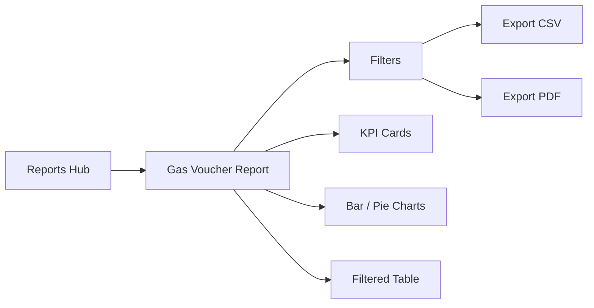

# Gas Voucher Reports Plan

## Overview

Add a dedicated **Gas Voucher Report** under Reports so finance and ops roles can filter vouchers, see KPIs and charts, and export the same filtered set as **CSV** or **PDF**—without changing approval or payment business rules.

## Current state (baseline)

Gas vouchers live under [`public_html/pages/gas-vouchers/`](../public_html/pages/gas-vouchers/) with list filters (status, search, date range) and simple status KPI cards. There is **no** report page, tabular CSV/PDF export, or analytics charts for vouchers.

Existing report patterns to reuse:

| Pattern | Source |
|---------|--------|
| Report hub card + filters + KPIs + table | [`pages/reports/trips.php`](../public_html/pages/reports/trips.php) |
| CSV (`fputcsv`, date-stamped filename) | [`pages/reports/export.php`](../public_html/pages/reports/export.php) |
| PDF (TCPDF landscape, summary + table) | [`pages/reports/export-pdf.php`](../public_html/pages/reports/export-pdf.php) |
| Charts (Chart.js + PHP JSON blob) | [`pages/dashboard/partials/charts.php`](../public_html/pages/dashboard/partials/charts.php), [`assets/js/charts/dashboard.js`](../public_html/assets/js/charts/dashboard.js) |

Schema highlights (`gas_vouchers`):

- **Approval status:** `draft` → `pending_review` → `pending_approval` → `approved` | `rejected` | `cancelled`
- **Payment status (approved only):** `unpaid` | `paid` | `processed` | `cancelled`
- **Money / fuel:** `total_cost`, `quantity`, `unit`, `fuel_type`, `other_items` / `other_qty`
- **Grouping dims:** `fund_source`, `gas_station`, `vehicle_plate`, requester via `requested_by_user_id` → `users.department_id` (no dept FK on voucher)
- **Dates:** `request_date`, `created_at`, `reviewed_at`, `approved_at`, `date_withdrawn`

Roles with gas access today: requester, approver, motorpool, admin, CAF. Guards: none. Reports hub today requires approver+ (`requireRole(ROLE_APPROVER)`), so **CAF cannot open Reports** until access is extended for this page.



## Design principles

1. **Same filters for screen and export** — CSV/PDF use identical GET params as the report page.
2. **Finance-useful KPIs** — counts *and* peso totals (not just workflow counts).
3. **Charts answer questions** — status mix, spend by fund/station, payment backlog—not decoration.
4. **Reuse trip-report stack** — TCPDF + `fputcsv`; no new spreadsheet library.
5. **Role-appropriate access** — CAF + motorpool + approver + admin; requesters stay on own list page.
6. **Soft-delete aware** — always `deleted_at IS NULL`.

## Target users & access

| Role | Access |
|------|--------|
| Chief Admin & Finance | Full report + exports (primary consumer) |
| Admin | Full report + exports |
| Motorpool Head | Full report + exports |
| Approver | Full report + exports (ops oversight) |
| Requester | No report page (use Gas Vouchers list for own rows) |
| Guard | No access |

**Routing gate:** `requireAnyRole([ROLE_APPROVER, ROLE_MOTORPOOL, ROLE_ADMIN, ROLE_CHIEF_ADMIN_FINANCE])` on the report + export scripts. Optionally allow CAF into the Reports hub card only (or widen hub later).

## Target UX

### Entry

1. New card on [`pages/reports/index.php`](../public_html/pages/reports/index.php): **Gas Vouchers** — “Spend, approval, and payment analytics” with CSV/PDF badges.
2. Deep link: `?page=reports&action=gas-vouchers`.
3. Optional later: “View report” link from Gas Vouchers list header for allowed roles.

### Page layout

1. **Title + date context** — Gas Voucher Report; default range = current month (`request_date` or `created_at`—document choice below).
2. **Filter bar** (GET form, sticky-friendly)
3. **KPI row** (6–8 cards, deep-linkable where useful)
4. **Charts row** (2–3 charts)
5. **Descriptive stats strip** (short text metrics)
6. **Data table** (sortable, capped for UI; exports use higher caps)
7. **Export buttons** — CSV / PDF (pass all current filters)

## Filters

| Filter | Param | Notes |
|--------|--------|------|
| Date from / to | `start_date`, `end_date` | Default: first/last day of current month |
| Date field | `date_field` | `request_date` (default) \| `created_at` \| `approved_at` |
| Approval status | `status` | Multi or single; empty = all non-draft optional toggle |
| Include drafts | `include_drafts` | Default off for finance views |
| Payment status | `payment_status` | unpaid / paid / processed / cancelled / all |
| Fund source | `fund_source` | Exact or LIKE from distinct list |
| Gas station | `gas_station` | Distinct values |
| Fuel type | `fuel_type` | Gasoline / Diesel / all |
| Department | `department_id` | Via `users.department_id` join |
| Requester | `user_id` | Optional |
| Search | `search` | voucher_no, driver_name, plate, purpose |

All exports inherit these query params.

## KPIs (filtered set)

| KPI | Definition |
|-----|------------|
| Total vouchers | Count in filter |
| Total amount (₱) | `SUM(total_cost)` |
| Pending review | `status = pending_review` |
| Pending CAF approval | `status = pending_approval` |
| Approved | `status = approved` |
| Approved unpaid (₱ / count) | `approved` + `payment_status = unpaid` |
| Paid / processed (₱) | Approved with `paid` or `processed` |
| Rejected / cancelled | Count of those statuses |

Card clicks may deep-link back to `?page=gas-vouchers&status=...` where that list filter exists.

## Charts

Use Chart.js (already in footer). New module: `assets/js/charts/gas-voucher-reports.js` fed by `window.gasVoucherReportAnalytics`.

| Chart | Type | Data | Why useful |
|-------|------|------|------------|
| Status distribution | Doughnut / pie | Count by `status` | Workflow bottleneck at a glance |
| Spend by fund source | Horizontal bar | `SUM(total_cost)` by `fund_source` (top 8) | Budget / chargeability |
| Spend by gas station | Bar | `SUM(total_cost)` by `gas_station` | Vendor concentration |
| Payment status (approved only) | Pie | unpaid / paid / processed | CAF cash backlog |
| Daily / weekly spend trend | Line (optional P2) | `SUM(total_cost)` by date | Seasonality |

Empty states: hide chart card or show “No data for filters”.

## Descriptive statistics

Show a compact “Insights” line or small panel (computed in PHP from the filtered aggregate query):

- Average voucher amount (`AVG(total_cost)`)
- Median amount (optional; PHP on capped sample if SQL median is hard)
- Min / max `total_cost`
- % of approved vouchers still unpaid
- Top fund source by spend (name + ₱)
- Top gas station by spend
- Average days from `created_at` → `approved_at` (approved only)
- Count of FULL TANK vs liter/quantity units (if useful for ops)

Keep copy short: one sentence + key numbers, not a long narrative.

## Table columns (UI)

Suggested columns (align with export):

`voucher_no` | `request_date` | requester | department | `driver_name` | plate | fuel | qty/unit | `fund_source` | `gas_station` | `total_cost` | status | payment_status | `approved_at` | `date_withdrawn`

- UI limit: **500** rows (same as trips report)
- Default sort: `request_date` DESC / `created_at` DESC via `table_sort.php`

## Exports

### CSV — `?page=reports&action=export-gas-vouchers-csv`

- Mirror filters; max **10,000** rows
- Headers = human labels; amounts as plain decimals
- Filename: `gas-vouchers-YYYYMMDD-YYYYMMDD.csv`
- `auditLog('data_export', ...)` with filter summary

### PDF — `?page=reports&action=export-gas-vouchers-pdf`

- TCPDF landscape A4
- Header: LOKA + “Gas Voucher Report” + filter/date range
- Summary block: key KPIs (count, total ₱, unpaid ₱, by status counts)
- Optional: simple text breakdown by fund_source (top 5)—charts in PDF are out of scope unless easy as static summary table
- Data table (max **500** rows) with note if truncated
- Filename: `gas-vouchers-report-YYYYMMDD.pdf`
- Audit log on export

## Technical approach

| Piece | Approach |
|-------|----------|
| Page | `pages/reports/gas-vouchers.php` |
| CSV | `pages/reports/export-gas-vouchers-csv.php` |
| PDF | `pages/reports/export-gas-vouchers-pdf.php` |
| Shared query | `includes/gas_voucher_report.php` — `gasVoucherReportFilters()`, `gasVoucherReportKpis()`, `gasVoucherReportRows()`, `gasVoucherReportAnalytics()` |
| Hub | Card on `pages/reports/index.php` |
| Routes | Extend `case 'reports'` in `index.php` |
| Charts JS | `assets/js/charts/gas-voucher-reports.js` |
| Access | `requireAnyRole` including CAF; denyGuardAccess if needed |
| Perf | Aggregate KPIs/charts via SQL `GROUP BY` / `SUM`; no N+1; index-friendly filters on `request_date`, `status`, `deleted_at` |

### Shared helper sketch

```php
// includes/gas_voucher_report.php
function gasVoucherReportParseFilters(): array { /* GET → normalized */ }
function gasVoucherReportWhere(array $f): array { /* SQL + params */ }
function gasVoucherReportKpis(array $f): object { /* counts + sums */ }
function gasVoucherReportAnalytics(array $f): array { /* chart series */ }
function gasVoucherReportRows(array $f, int $limit): array { /* list */ }
```

Join for department:

```sql
FROM gas_vouchers gv
JOIN users u ON gv.requested_by_user_id = u.id
LEFT JOIN departments d ON u.department_id = d.id
WHERE gv.deleted_at IS NULL
  AND /* date_field BETWEEN ? AND ? */
```

## Phased rollout

1. **P0 – Foundation**
   - Shared filter/KPI/row helpers
   - Report page: filters + KPI cards + table
   - CSV export with same filters
   - Hub card + routes + CAF access on this action

2. **P1 – Charts & insights**
   - Status pie, spend-by-fund bar, payment pie
   - Descriptive stats strip
   - PDF export with KPI summary + table

3. **P2 – Polish**
   - Spend trend line chart
   - Department bar chart
   - Empty/error states, print-friendly PDF header logos if available
   - Optional admin export type `gas_vouchers` in admin reports hub
   - Deep links from dashboard CAF KPIs → pre-filtered report

## Success metrics

- CAF/admin can answer “How much unpaid approved fuel this month?” in one screen.
- CSV/PDF row set matches on-screen filters (spot-check counts).
- Charts update when filters change (full page GET reload is fine).
- Requesters/guards never reach the report URL.
- Export completes under existing trip-report performance expectations (caps enforced).

## Out of scope

- Changing approval/payment workflows or voucher print layout.
- Realtime websockets / live dashboards.
- Excel/PhpSpreadsheet (stick to CSV + TCPDF).
- Embedding Chart.js images into PDF (use numeric summary tables instead).
- Per-requester “my spend” personal report (can be a later add-on).

## Open decisions (resolve at implementation)

1. Default date field: `request_date` vs `created_at` (recommend **`request_date`** for finance).
2. Whether drafts appear by default (recommend **hidden**).
3. Whether Reports hub itself opens to CAF globally, or only the gas-voucher action is gated for CAF.
4. Currency formatting: PHP `number_format($n, 2)` with ₱ prefix in UI/PDF; raw in CSV.
